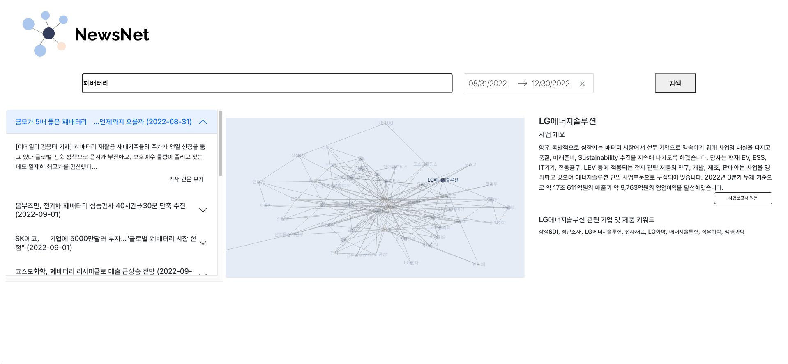

# KPMG Ideathon
This repository contains the code and resources for our submission to the KPMG Ideathon competition. Our team, 데싸칭구들, consists of 서아름, 손성욱, 임찬송, 최유림, 허상우, (박건도).

## Project Description
**NewsNet** is a tool designed to help users collect, analyze, and visualize information from news articles and industry reports. The tool was created in response to the problem that a large quantity of news articles contain valuable information, but are often too distributed for humans to effectively utilize.

Our tool addresses this problem by allowing users to input a keyword or phrase, which the tool uses to **collect** relevant news articles and industry reports from a variety of sources. The tool then uses name entity recognition (NER) to **extract** relevant information, such as key concepts, entities, and relationships, from the articles. This information is then **integrated** into a knowledge graph, which provides users with a visual representation of the key concepts and relationships between them.



The knowledge graph allows users to explore the information in a more intuitive way, enabling them to quickly identify patterns and connections that may not have been immediately obvious from the original articles. In addition, the tool provides several other features to enhance the user experience:

- Article Clustering: The tool clusters and drops relevant or duplicated articles.

- Industry Report Details: The tool extracts relevant information about corporations from industry reports and displays it on the right side of the interface for easy reference.

- Wiki Reference: The tool embeds hyperlinks to relevant Wikipedia pages on unfamiliar terms mentioned in the news articles for users' convenience.

Overall, NewsNet is a powerful tool for anyone who needs to analyze large amounts of information from news articles and industry reports. Whether you're a researcher, journalist, or business analyst, our tool can help you uncover valuable insights and make informed decisions.

## Getting Started
To get started with NewsNet, follow the steps below:

### Prerequisites
Before using NewsNet, make sure you have the following software installed on your computer:

- Python 3.8 or higher
- pip package installer

### Installation
1. Clone the NewsNet repository to your local machine:

```git clone https://github.com/dlacksthd94/KPMG-ideathon.git```

2. Create a conda enviroment and install the required Python packages:

```bash setup_env.sh```

### Details
1. IE/

Functions to process Dart / News data

2. KG/

Functions to use processed data from IE to create Knowledge Graph

Helper functions

3. app/

Interactive and intuitive application displaying NewsNet

### Credits
[Pororo](https://github.com/kakaobrain/pororo) for information extraction and summarization

[Dash](https://dash.plotly.com/) for making UI

### License
This project is licensed under **the Apache License 2.0.**
